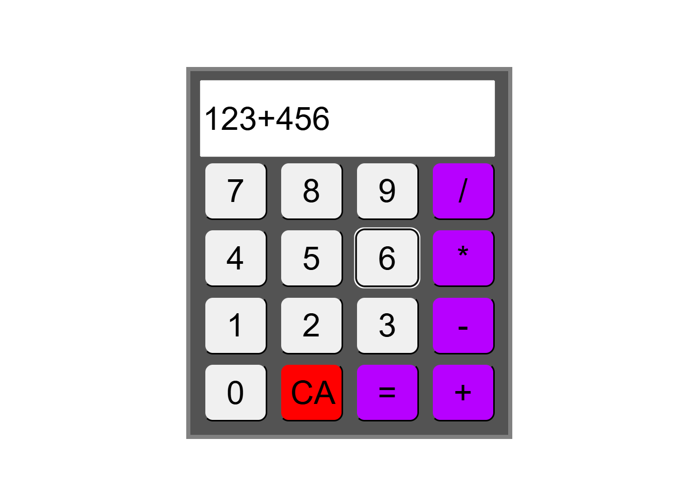

# JavaScript Calculator 🧮

A simple web-based calculator built as a front-end practice project using vanilla HTML, CSS, and JavaScript.

## 📸 Screenshot



## ✨ Features

-   **Basic Arithmetic:** Performs addition, subtraction, multiplication, and division.
-   **Display:** A single screen to show user input and calculation results.
-   **Clear Function:** A `CA` button to easily reset the current input.
-   **Chained Operations:** Supports sequential calculations (e.g., `5 * 4 + 2`).

## 💻 Technologies Used

-   **HTML5:** For the basic structure of the application.
-   **CSS3:** For styling the calculator's layout and appearance.
-   **JavaScript (Vanilla):** For all the operational logic and user interaction.

## 🚀 How to Run

This is a static web project and requires no installation. To run it locally, follow these steps:

1.  **Clone the repository:**
    ```sh
    git clone [https://github.com/PedroMagno07/javascript-calculator.git](https://github.com/your-username/javascript-calculator.git)
    ```

2.  **Navigate to the project directory:**
    ```sh
    cd javascript-calculator
    ```

3.  **Open the `index.html` file** in your web browser.

That's it! The calculator will be up and running.

## 📄 License

This project is licensed under the MIT License.
